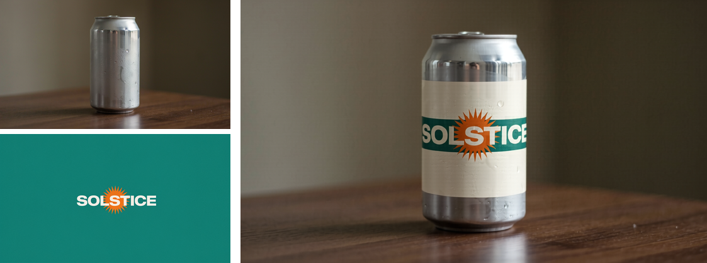
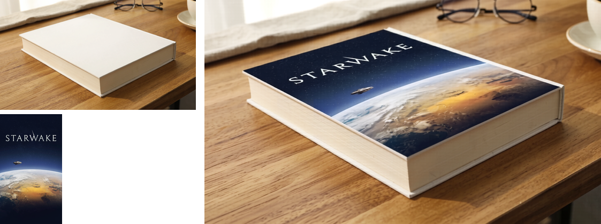
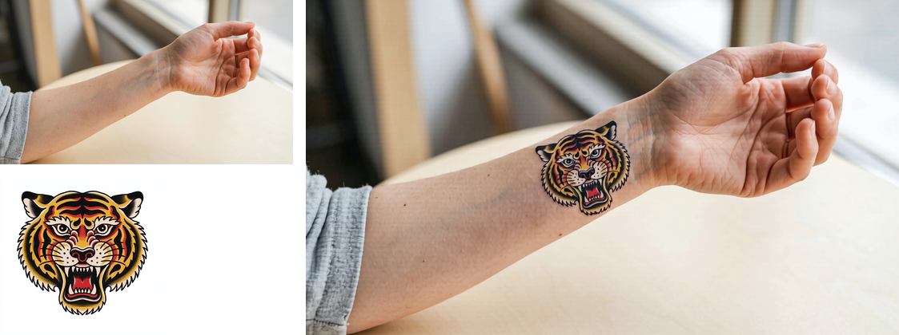

# h3edit — instruction-based image editing with MiniMax H3, on Apple Silicon

MiniMax H3 is an open-weight 33B **video** model. It turns out to be a strong instruction-based
**image editor**: render exactly **one frame** of its reference-to-video (R2V) mode, decoded
through a VAE retrained for single images. This repo is the **Apple Silicon port** of that
technique — the original recipe is CUDA-only — plus a CLI and a ComfyUI custom node that make it
a one-command tool.


*Two references in (a bare wall, a flat artwork), one image out. Every brick course and mortar
joint reads through the paint, and the window cuts the design exactly as it cuts the wall.*

```sh
h3edit "$(cat edit.txt)" -r scene.png -r artwork.png -o out.png --wait
h3edit --doctor
```

## Credits — this is a port, not an invention

- **Technique** (one-frame R2V as an image editor): [Patient_Ratio4177 on r/StableDiffusion](https://www.reddit.com/r/StableDiffusion/comments/1vo1ab3/h3_as_a_singleimage_edit_model/)
- **Single-image VAE**: [Mamad8/MiniMax-H3-Image-VAE](https://huggingface.co/Mamad8/MiniMax-H3-Image-VAE)
- **Turbo 8-step LoRA**: [lightx2v/Minimax-h3-Turbo](https://huggingface.co/lightx2v/Minimax-h3-Turbo)
- **Pruned Ref2VA GGUF**: [Abiray/MiniMax-H3-Pruned-GGUF](https://huggingface.co/Abiray/MiniMax-H3-Pruned-GGUF)
- **ClipProj text encoder**: [NicoLab28/ClipProj-MiniMax-H3](https://huggingface.co/NicoLab28/ClipProj-MiniMax-H3)
- **MiniMax H3** itself: MiniMax, via the [Comfy-Org/MiniMax-H3](https://huggingface.co/Comfy-Org/MiniMax-H3) repack

The author's own recipe needs CUDA three times over (an `int8_convrot` hybrid checkpoint, an
`nvfp4` encoder, comfy-kitchen attention) and runs ~8s/image on an RTX 5090. This port swaps in
GGUF + fp8 pieces that run on MPS. It is slower — minutes, not seconds — but fully local on a Mac.

## Demos

All references are AI-generated (Ideogram 4 for the artworks, Krea 2 for the scenes), all
fictional brands. Left: the two inputs. Right: the h3edit output.

| | claim demonstrated |
|---|---|
|  | Type compresses correctly around a **cylinder**; the scene's condensation sits **on top of** the applied label. |
|  | The added sign is a **light source**: pink/blue glow on the brick, and a second coloured reflection in the wet pavement **alongside the existing warm one**. |
|  | **Perspective warp** — the artwork's horizontals converge exactly as the cover's own edges do, stopping at the boards. |

Prompts for every demo are in [`demos/prompts/`](demos/prompts), the reference-generation specs
in [`demos/specs/`](demos/specs), and the original author's 11 worked prompts in
[`prompts/reference_prompts.txt`](prompts/reference_prompts.txt).

### Where it fails, honestly



Two attempts — with a texture-rich skin reference and explicit healed-ink language — could not
make a tattoo read as ink **under** skin: it lands as a sticker, and the drawn tiger's face
deforms where letterforms never did. The pattern across all five demos:

**H3 transfers flat graphic marks and type with near-perfect fidelity, and applies surface
physics it can see (curvature, masonry relief, perspective, light emission). It degrades on
detailed illustration, and will not invent subsurface material properties it has no geometric
evidence for.**

Also true everywhere: this is a **regeneration conditioned on the references, not a masked
edit**. Scene, lighting, shadows and composition carry; fine detail (chrome trim, thin edges)
gets redrawn. Right for mockups and try-ons, wrong if the output must composite pixel-exactly
against the untouched original.

## Install

Needs: Apple Silicon Mac (developed on 48 GB; the model set wants ~30 GB free RAM),
[ComfyUI](https://github.com/Comfy-Org/ComfyUI) ≥ 0.32 with
[ComfyUI-GGUF](https://github.com/city96/ComfyUI-GGUF), Python ≥ 3.10, `uv`.

**1. Models (~33 GB total).** Paths are relative to your ComfyUI `models/` dir and must match
exactly — the graph refers to them by these names:

| file | put at | size | from |
|---|---|---|---|
| `MiniMax-H3-Ref2VA-Pruned-Q5_K_M.gguf` | `diffusion_models/_h3/` | 14.1 GB | [Abiray/MiniMax-H3-Pruned-GGUF](https://huggingface.co/Abiray/MiniMax-H3-Pruned-GGUF) |
| `qwen3vl_8b_fp8_scaled.safetensors` | `text_encoders/_h3/` | 10.6 GB | [Comfy-Org/MiniMax-H3](https://huggingface.co/Comfy-Org/MiniMax-H3) |
| `mmh3-8b-ClipProj-celeb-mlp.safetensors` | `clip_projections/` | 0.4 GB | [NicoLab28/ClipProj-MiniMax-H3](https://huggingface.co/NicoLab28/ClipProj-MiniMax-H3) |
| `minimax_h3_t1_image_vae_step1597.safetensors` | `vae/_h3/vae/` | 5.2 GB | [Mamad8/MiniMax-H3-Image-VAE](https://huggingface.co/Mamad8/MiniMax-H3-Image-VAE) |
| `minimax_h3_audio_vae_fp32.safetensors` | `vae/_h3/vae/` | 0.6 GB | [Comfy-Org/MiniMax-H3](https://huggingface.co/Comfy-Org/MiniMax-H3) |
| `minimax_h3_fl2v_turbo_8step_v1.0_comfyui_bf16.safetensors` | `loras/` | 2.0 GB | [lightx2v/Minimax-h3-Turbo](https://huggingface.co/lightx2v/Minimax-h3-Turbo) |

(The audio VAE is required even for stills — H3 is a joint audio+video model and the graph
decodes both; the audio side of a single frame is discarded.)

**2. The single-frame custom node** (this repo, `custom_nodes/h3_single_frame/`):

```sh
ln -s "$(pwd)/custom_nodes/h3_single_frame" /path/to/ComfyUI/custom_nodes/h3_single_frame
```

ComfyUI floors frame count in two places — `min=5` on the length widget, and
`align_frame_count()`, which snaps anything below 5 back up to 5 — so a naive `length=1`
silently renders 5 frames (and taking frame 0 of those gives grid artifacts under the image
VAE). The node rebinds three module functions at import. **Deliberately not a patch to
ComfyUI's source**: `custom_nodes/` is gitignored in the ComfyUI checkout, so a `git pull`
there can never revert it. Restart ComfyUI after linking.

**3. The CLI:**

```sh
uv tool install --force -e .
h3edit --doctor      # checks ComfyUI, the custom node, and the graph's reference inputs
```

If ComfyUI is not on `127.0.0.1:8288`, set `H3EDIT_COMFY`, `H3EDIT_INPUT`, `H3EDIT_OUTPUT`.

## Usage and dials

```sh
h3edit "Task: Reference-guided generation. ..." -r scene.png -r artwork.png \
  --ar 16:9 --seed 42 -o out.png --wait
```

| flag | default | why |
|---|---|---|
| `--steps` | 8 | at 6 the model rendered the subject **twice** |
| `--mp` | 2.0 | see below — this also sizes the references |
| `--ref-size` | `match` | `max` pins refs to a 2048px short edge: ~10× slower for no visible gain (measured 72:48 vs 7:30, of which sampling was only 8:44 — the rest was reference encode) |
| `--ar` | `21:9` | pick the one matching your scene |

**Megapixels is secretly the reference-resolution dial.** With `match`, references are scaled to
the *generation's* pixel area — at `--mp 1.0` a 1024px wordmark was squashed to ~650px before H3
saw it and came back airbrushed with a halo. 2.0 is clean. Timing on an M5 (2208×960, 2 refs):
**7–10.5 min** per image; there is real run-to-run variance.

**Judge results at 100%, never at thumbnail size.** A render that looks clean at feed size can
have deformed letterforms and a soft halo. Crop the edited region and compare it against the
reference before calling it good.

## Prompt grammar

Cite images as `<Picture 1>` / `<Picture 2>`. The skeleton that works:

1. `Task: Reference-guided generation.`
2. **A negative role assignment** for the asset image — the anti-bleed device:
   > `<Picture 2>` is the label artwork reference and supplies nothing else. It does not supply
   > a scene, a container, a background, or lighting.
3. The edit itself, with **"exactly one"** stated in words — "the front and rear doors, spanning
   both" was rendered as one copy *per door*.
4. An exhaustive **preserve list** naming everything from `<Picture 1>` that must survive.
5. A closing sentence naming the output form: *"A single coherent photograph shows …"*

Every demo prompt in `demos/prompts/` follows this shape.

### Making reference artwork (the part that will bite you)

If you generate the asset image with a text-to-image model, **nouns summon their conventions**:

- asking for a *poster* added a printed border and a garbled corner date line
- asking for a *label* added an ingredient panel, a nutrition block and a barcode
- a *roundel* became a badge — and a badge wants tiny text inside it

All that furniture arrives as garbled micro-text, and H3 reproduces letterforms **faithfully** —
garbage in the reference becomes perfectly-transferred garbage on the product. The fix is never
another seed or another adjective: **swap the noun** (*mural painting*, *banner*) for one whose
conventions you actually want, and keep any wordmark inside the middle half of the artwork if it
must survive being wrapped around a cylinder — a cylinder only ever shows ~40% of a full-width
strip.

## The graph

`api_graph.json` is the ComfyUI frontend's own `graphToPrompt()` output, exported once — **never
hand-written**. H3's reference images are an autogrow input that only serializes correctly
through the frontend, as dotted `ref_images.ref_image_N` keys; a hand-assembled graph drops them
with no error and silently renders an unreferenced image. The CLI only sets values into the
exported graph and **refuses to queue if those keys are missing**.

To change the wiring: load `h3_image_edit_mac.json` in the ComfyUI GUI, edit there, then
re-export with `H3EDIT_CDP=<port> h3edit --export <tab-id>` (drives the frontend over CDP).

## License

MIT. The models above carry their own licenses — check them before commercial use.
